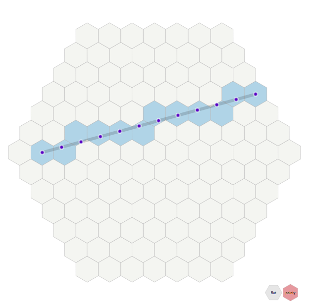
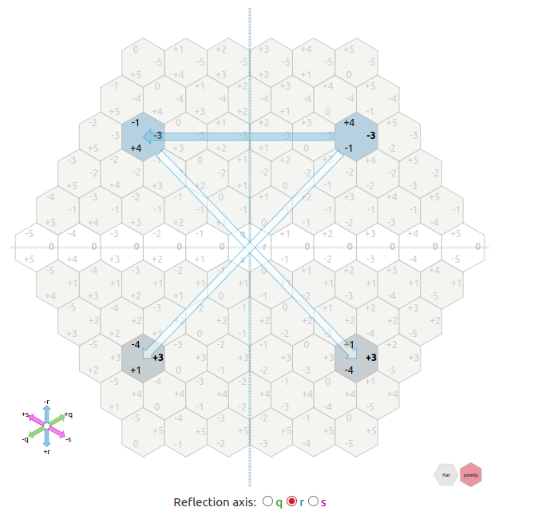

# Everything is sets and transformations
- All we have is sets of objects and operations (functions/transformations/mappings).
- Sets are objects too.
- Opearions can be used as objects themselves - as inputs to other operations.
- Not everything is an operation: objects that are wrapped (take 0 arguments and return
  themselves) are not the same as unwrapped object.
- Examples of sets of objects and operations on them:
    - Numbers are object that encode some quantity.
      Couning, addition, multiplication, substraction etc - operations on numbers.
    - Geometric objects are sets of points.
      Rotations, angle and distance measurements are all operations on those sets
      of points.

- Nothin in the middle:
    1. Engeneer, analist, a bit of math for interviews, mostly analist.
    Здесь отпусти себя и разреши себе тупо по инженерному херачить, тупо как
    vim или tmux больше запоминать и практиковаться, не парься по фундаменту
    Draw a big picture and then study smaller parts.
    2. Super deep math knowlage scientist
    Тут супер максимально фундаментально с пониманием итд.

TODO:
1. Using facts about real space (line 5 in "spaces") describe the process of building
  a Euclidean space and then measuring distances and lengths (squiggly lines) in that
  space using rotations of axis.
  Если линии и любые фигуры это наборы точек то измерять всё нужно в числе точек.
  Но мы в евклидовом пространстве так не делаем, мы измеряем типа если вот взять и развернуть ось.
  Получается что да, мы дробим пространство на квадратики, но чтобы посчитать расстояние, мы
  разворачиваем оси чтобы квадратики ровно встали, чтобы дать там длину в реальном пространстве
  как будто помехи на кривость хождения по квадратикам у нас нет.
  Представь площадь прямоугольника - так лечге всего. Есть типа выровненный по осям четкий
  прямоугольник а есть развернутый стремный. Но в реальном пространсве наших тупых осей нет и в реальном
  оба этих прямоугольника четкие. Так что мы как бы пользуемся своими тупыми осями но в то-же время
  постоянно типа их разворачиваем для того чтобы число кубиков/точек нашего кривого пространства
  совпадало с числом точек реального пространства.

- SHORT:
  Real space is discrete and we can feel (but not see/imagine) amount of steps between points
  in a physical space.
- To reason about gemetrical figures we need a way to label points in a physical space.
- We came up with a Euclidean space.
    - Euclidean space __defines a unit amount of steps__ in a real space as a unit distance.
    - Euclidean space __uses right angles as an axiom__. 
      Right angles can be defined in different ways.
      Right angles are just convenient to use.
- Now all geometric objects (sets of pounts of real space) are __defined somehow in terms
  of points of our Euclidean space__.
- Using properties of right angles, we can algebraically count different facts about geometric
  figures that are in our Euclidean space.
- В общем тупо пометили точки реального пространства с помощью прямых углов и теперь можем
  вывести всякие формулы про всякие фигуры итд.
- Могли бы пометить по другому и таких разметок очень много.
- Геометрические фигуры это тупо наборы точек реального пространства
  Их можно видеть и как наборы точек Евклидового пространства, но это будет не точно, если
  мы говорим что пространство дискретное.
  Можно считать тупо число точек евклидового пространства в фигурах, но это будет не точно так
  как нас интересует число точек реального пространства. В связи с этим у нас есть разные
  способы как типа повернуть много раз евклидово пространство и посчитать число точек
  реального пространства в единицах которые мы задали при определении Евклидового пространства.

------------------------------------------------------------------------------------------

- We, as a participants of a real physical space, can not really see smallest parts of it.
  __All we can is to feel how much distance if from one point to another__.
- __Geometrical figures are measured in regions of real physical space__ as if we would turn our
  Euclidean space to lign. 
  Понять сколько кусочков реального пространства есть между точками (кратчайшая дистанция) мы
  можем тупо линеечкой (которая является размеченным куском физического пространства), плюс
  у нас для этого есть всякие формулы как это посчитать если мы создали Евклидово пространство
  поверх реального физического.
  Геометрические фигуры измеряются количеством кусков (тточек) реального пространства
  И мы типа разворачиваем своё евклидово пространство чтобы измерить так как наше Евклидово
  не совсем точно измеряет из-за того что мы сами произвольно выбрали направление квадратиков.
- So, all geometrical figures are a bunch of Eulidean dots, yes. But the distances, volunes,
  lengths and areas can only approximately be measured by counting those stepps between Euclidean
  dots (accounting for a value of those steps). The more precise way is to come up with formulas
  that give us the amount of real physical space that those figures cover (that is what we really
  interested in). Amount of dots is just an approzimation to amount of real physical space.
- Мы составляем евклидово пространство __изначально используя прямой угол__. Он уже есть как 
  данное, как аксиома.
- Хуету типа углов мы тупо задаём концептульно, абстрактно, примерно, не точно. Мы говорим
  типа если разделить плоскость на 4 ровных гла то получится прямой угол, или в квадрате вот
  прямой угол, ещё прямой угол это вот такое соотношение pi и радиуса. Это тупо концепция
  которая учавствует в разных фигурах и всё.
  Мы просто концептуально говорим ок, вот ревальное пространство, вот давайте на нем закрасим
  два набора точек, и определим что типа прямой угол это если разделить плоскость на 4 равных
  угла. Теперь мы этим определением пользуемся чтобы задать векторы точкам реального пространства.
  По определению вектор присваиваем как число реального пространства от 0 на каждой из осей,
  после того как мы на ось провелю ортогональную проекцию.
  Всё, рисуем мы это примерно но такое определение помогает нам вывести формулы для длиины,
  расстояния (количество точек реального пространства) между нашими векторами и такой способ
  разметки пространства помогает легко выводить всякие факты о разных наборах точек реального
  пространства.

- Real physical space:
    - A set of points/vectors
    - Location. Object can be located at a particular vector
    - Distance. Moving between points/vectors have different cost
      and we feel this cost.
    - To "see" something is to have a bunch of photons mote from
      some point to a points where our eyes are located. Then we
      detect how close different point to each other and what they
      contain and build it in our imagination.
    - Лучше всего всё-же представлять физическое пространство как
      набор точек (млм многоугольников с точками в центре).
      Между этими точками нет пространства, нет никаких линий между
      ними по определению, но движение в любом направлении стоит
      одинаково и нам на массштабе 
      Как этот hex grid выровнене не важно, там нем в принципе
      никакого выравнивания, так как это и есть пространство и то
      что мы видим как расстояние это число шагов в этом hex grid.
      So, if we draw a circle, that means were are equal amount of
      real space steps to each point on a circle. 
      So, real space only measured in the amount of real space steps.
      And we measure distance in a Euclidean space as an estimate of
      real space steps, not as a number of euclidean space steps/points.

- Представляем реальное физ пространство так:
    - A set of points/vectors + distance (cost of moving) measure.
    - Our brain interprets this discrete set of points and discrete
      distance measures in a particular way.
      Those points have no spacial order/location, they are space itself,
      they are really a mathematical set of vectors and distance measures.
      Между этими реальными векторами есть мера расстояния (цена передвижения)
      и мы эту цену чувствуем, но как там она реально задана под капотом хз.
    - If we do a max zoom in, our brain can no longer interpret them in a
      familiar continious way and just gives us a set of vectors (I assume).
      Потом когда уже слишком приблизили, просто картинка кончается
      наш мозг не способен её воспроизвести и мы видим тупо несколько
      векторов отвецащих за это пространство (тупо мат символы в
      подмножестве).
    - Но пространство дискретное и цена передвижения в реальном пространстве это
      тупо количество шагов.
    - Мы можем приблизительно понять количество шагов
    - Мы живем в множестве векторов и воспринимаем его как воспринимаем,
      видим равную дистанцию значит реально равная дистанция.
      Это просто картинка котрую нащ мозг красиво рисует видя точки
      и меру дистанции между точками.
    - Мы можем этой картинкой воспользоваться и типа поставив свои точки
      на точки реального пространства тоже задать меру дистанции
      между нашими точками как количество шагов (дистанцию) реального
      пространства.

- Одинаковое расстояние это именно одинаковое количество дискретных
  шагов в реальном физическом пространстве.
- Даже если типа представить реальное пространство как набор точек
  или многоугольников где возможны только квантовые прыжки между
  точками, то всё равуно там будет типа интуитивно видно именно расстояние
  оно будет казаться разным, но на деле, число этих прыжков и есть
  расстояние - по определению. 
  Реальное пространство не расчерчено никакими многоугольниками на самом
  деле, а если расчерчено - то нам не важно как, мы то можем воспринимать
  только функцию - цена прыжка между точками. Это и есть пространство,
  дистанция, площать для нас. Там под капотом не важно как рачсерчено,
  мы воспринимаем так как задана функция дистанции между этими дискретными
  точками. И да, это именно точки и лучше их так воспринимать, а не как
  участки.
- Мы видим и чувствуем это количество шагов, но не можем увидеть сам
  процесс самого маленького шага.
- 

- Есть реальное физическое пространство.
- Real physical space is a bunch of dots with:
    - distance between them defined (distance for each pair of dots)
      Distance is a measure of how expensive it is moving from one not to another
    - Objects like particles can be located in those dots and move between them.
- How to imagine space - dots (vectors) with connectivity measure.
  We can not imagine smallest part of space, for us it will always seem continious. But it's not, most likely.
  Реальное пространство не нужно и не правильно представлять как кусочки/фигурки/точечки на каком-то
  расстоянии итд. Все это как бы уже использует пространство, что не имеет смысла.
  Представлять пространство нужно не используя пространство - как тупо набор векторов (не обязательно
  числовых тюплов) между которыми задана мера дистанции и мы эту меру дистанции чувствуем и с её
  помошью её выводим расстояния, углы итд.
  И так как наш мозг не способен представлять пространтво без пространства.
  Мы видим реальное пространство, объекты в нем (наборы точек) и как эти объекты расположены относително
  друг друга. Мы видим что вот в этом кусочке пространства есть вот эта частица итд.
- Unit of a real phisical space will always be smaller
  We would not even be able to see those discrete jumps between vectors in physical space, because
  the "jump" is actuarry required space to jump over
- Euclidean space is also a bunch of points with a connectivity measure.
  Distance between points is measured as the amount of real physical space between those dots.
  We set the unit amount of length - unit amount of real physical space
- Далее мы разделяем пространство на маленькие кусочки определённым образом. Наше порезанное новое
  пространство (тоже набор точек) называется евклидово пространство.
- В Евклидовом пространсве мы используем число реального пространства как меру расстояния/длины.
- Так как мы всегда можем повернуть свое евклидово пространство, реальное пространство таких направлений
  же не имеет, то мы можем не мучаться с приближениями а тупо считать реальную длину в реальном пространстве
  как бы для подсчёта длины используя количество единичных шагов реального пространства (мы выбрали сами
  единичный шаг).
- Когда у нашего пространства есть минимальное разрешение (точки лучше представлять чем квадратики)
  дистанции будет дискретными и некоторые из них будут сокращаться и оверфлоу итд.
- Так как представить минимальную длину реального пространства - невозможно, мы представляем что
  минимальное разрешение есть у нашего выдуманного Евклидова пространства, мы сами задаём эту минимальную
  длину и потом в числе этих длин считаем расстояния (типа если развернуть оси, то сколько минимальных
  заданных нами расстояний тут будет).
- Единицу реального пространства мы задали
- Далее мы используем расстояние в реальном пространстве как меру расстояния между точками в нашем
  вымышленном Евклидовом пространстве.

# Spaces
- One way to think of the Euclidean plane is as a set of points satisfying certain relationships, 
  expressible in terms of distance and angles. 
- We have our real space where any particle can move from one point to another.
  We, as a bunch of particles, move in that space. And that is all we do basically.
- In our real space we live in we know (see):
    - How points are located, in relation to each other (order).
    - We can step to (and only to) neighbouring points.
    - How much a movement between points cost (distance).
      Movement in any direction cost the same.
    - ПРИ ВЫВОДЕ ЛЮБЫХ ТЕОРИЙ ОРИЕНТИРУЮСЬ ТОЛЬКО НА ЭТИ ФАКТЫ.
- We can then label points of our real space somehow, using some labelling method. 
- One method is label points in real space is called "equcledian space":
    - In a Euclidean space, smallest regions of space are squares/cubes
    - Количество шагов - всё что имеет значение. Не представляй шестиугольники и расстояние
      между ними в реальном пространстве. Нет. Расстояние в реальном пространстве И ЕСТЬ КОЛИЧЕСТВО
      ШАГОВ В НЕМ.
    - Мы изначально стороны видим что типа движение в любую сторону занимает одну дистанцию
      так как ДЛЯ НАС это типа одна дистанция, а как там внутри у пространтва устроено все хз.
      Но суть в том что нам нужно как то самим математически квантизовать физическое пространство
      так чтобы мы могли говорить а фигурах как о наборах точек и о длинах как о числе необходимых для
      фигуры точек (если это возможно хз).
      Возможно о длинах лучше говорить как о числе точек физического пространства, то есть не
      наших Евклидовых точек/квадратиков а вот мы сами ок, свои точки можем расставлять только на
      ограниченное число квадратиков где есть минимальных квадратик но расстояние все равно хотим измерять
      не в числе закрашенных квадратиков а в __количестве точек реального пространства между нашими вымышленными 
      квадратиками.__ И тгда нужно полюбому типа разворачивать, так как наши оси по определению показывают
      нам чиссло шагов в реальном пространстве.
    - Нам не нужно думать типа "а как реальное пространство так всё уложило в себя что всё так
      ровненько" - нам КАЖНСТЯ что всё ровненько так как мы воспринимаем что ровно то, что это
      пространство даёт нам воспринимать ровным. Так что теперь мы тупо хотим подстроить по это пространство
      свое Евклидово пространство и ещё потом измерять длины/расстояния в реальном пространстве между
      разными евклидовыми точками и число физического пространства занимаемое кривыми.
      Да, мы реально всегда оперируем разворотом, типа оп развернули, ну вот. 
      И в матане тоже типа ну провели несколько касательных, вод и длина кривой, пожалуйста.
      Всегда мы все измеряем прямыми которые мы развернули, развернутыми осями.
      Только так мы можем убрать погрешность.
      Считать число евклидовы квадратиков  - ПРАВИЛЬНО, НО НУЖНО СНАЧАЛА РАЗВЕРНУТЬ ОСИ!!!
    - ИЗНАЧАЛЬНАЯ резметка реального пространства:
        - Ок, берём 2 прямые где количество реального пространства между точками одинаковое
	  (что такое прямая?)
	- Ставим эти прямые препендикулярно друг-другу
	  (Что значит перпендикулярно?)
	- Близжайшая точка на каждой из прямых - координаты
	  (как мы находим близжайшую точку?)
    - Мы измеряем дистанции не как количество наших евклидовых кубиков а как количество кубиков
      но если бы мы развернули оси. Считать кубики/точки не вариент, выходит дерьмо, на любом массштабе.
      Получается слишком изрезанная линия. За счёт этого всегда большая погрещность, процент 
      погрешности не уменьшается, даже если брать очень длинные линии. Так что нам нужен типа
      разворот осей. Мы же знаем что евклидово пространство это не правда, что нас интересует
      число шагов в реальном пространстве а все изрезав Евклидовой решёткой и считая эти евклидовы
      квадратики, мы очень плохо приближаем количество реального пространтсва между евклидовыми точками.
      Если считать точки.кубики не разворачивая - всегда будет погрешность, не зависимо от массштаба
      в процентном отношении она будет одна.
      Но что вообще значит развернуть оси?
    - Мы чувствует количество шагов между двумя точками, так-что можем расставить точки каждой из
      осей координат. Все, у нас есть евклидово пространство и дальше мы работаем только с ним
      и расстояние измеряем в нем, по посчитанным заранее формулам, определяющим реальную дистанцию
      между точками в физическом пространстве.
    - Теперь расстояние для нас - количество шагов в евклидовом пространсве.
    - После того как мы расставили точки координат, кординаты  любой другой точки точки - количество 
      минимальных шагов в Евклидовом пространстве до линии координат (набора точек).
    - It actually does not label all real points, because diagonal steps cost more
      so it is only an approximation. We can not go to the smallest region of space
      using this method. we can only zoom out a bit and label like every 10th or 100th
      point of a real space that will make our labelling look good.
    - In this approximation, moving to a diagonal neighbouring point cost sqrt(2), instead of 1.
      Moving to other neighbours cost 1, as expected.
    - So, we zoom out a bit, label each 100th point of real space with a Euclidean space points
      say that this is a smallest region of space and we will use it as such.
    - This is just a visual labelling. And using a visual labelling we undesrtand that diagonal
      movement cost sqrt(2) steps on real space.
    - As a distance between our imaginate Euclidian space, we use distance between those points in
      a real physical space. Like: "ok, if we take that amount of space as 1 and label space
      using 2 perpendicular axis to that orthogonal projection gives us the vector, then the
      distance between any 2 points will be the amounty of those unit regions".
    - In linear algebra we pretend the Euclidean space is the reality (it is very convenient)
      and use it for everything.
    - So, in short: label each 100th point of real space the way that there are 2 axis with
      equal steps and orthogonal to each other and then pretent that it is a real space, but
      only use labelled dots now. Amount of real space steps between those dots will be how
      we define distance between our Euclidean dots.
- That is it, I just labelled all points of real space with my Euclidian points in a
  meaningful and convenient way. Then define a distance between my points as a distance
  in a real physical space, undarstant how to count it mathematically and we done.

 
 
 

# Geometry
- We create a Euclidean space and then operate on sets of points in that space
- Any figure is just a set of points in our space
- In a Euclidean space, smallest regions of space are squares/cubes
  So we see any figure as a set of points or a set of colored squares/cubes.
- Angle is measured by dividing the amount of space (steps in a physical space or number
  of Euclidean space dots/squares) needed for an arc by the amount of eiclidean dots 
  needed for a radius by the amount of eiclidean dots 
  needed for a radius.
- Volume is the amount of euclidean points/squares needed for the figure
- A curve/line (function) might only have 1 vertical Euclidean dot/cube

# Algebra
- We have different sets of numbers
- We have operations on those numbers
- Those operations have some properties and methods to execute them
- Operations are consist of smaller operarions
- Smallest operation is increment/decrement/count - all kind of the same thing
- Count operation: take a set of numbers with order relation defined on them
- Order relation is basically a function that maps a finite set of numbers to itself
  This is just a function that kaes a number as input and returns a next number
  We take a set of numbers and define such a function on that set.
  We also define decrement (or count backwards) function.
  Havint those 2 functions we can now define addition, multiplication, substruction, 
  division and so on.

- Да, так получается что минимально возможный шаг по диагонали больше минимально возможного
  шага вбок/вверх, что бред, так как выбрать нклон осей мы можем любой и диагоняль можем
  направить в любом направлении. Но мы миримся с этим ради удобства.
- Ещё прикол в том, а как задать что такое "сосед" в плане чисел?
- Hexagonal Coordinate System - all neighbours are the same distance from each other
  but fuck knows how to properly label them with vectors so it make sence. Maybe label them with
  3-tuples but those 3-tuples are restricted (because we are in 2d).
- So BASICALLY, we need to label each point in a real physical space the way that:
    1. Distance (cost of moving) between neigbours is the same in any direction.
    2. It is convenient to label with vectors (tuples of numbers).
    3. In a rectangular grid system, diagonal step is always side\_step*sqrt(2)
    4. Hex system have a property of all neighbours are the same distance (cost of moving)
    but it's not obvious how to label it with vectors, and it's only in 2d.

# Basic stuff
- Usually we have a set of objects and operations defined on this set.
- every object has properties (operations on it) and it's meaning in a real world
- Every function/operation has it's algorithm, properties (distributive etc) and 
  it's meaning in real world.
- Functions/operations are also objects.
  We might have a function that does composition of functions, tnus, operates on
  functions as objects.
- Example: vector space - set of vectors with operarions like addition and scalar
  multiplication over some field (can bee seen as just a bunch of multiplication 
  operations).

Ок, это просто множество и на нём задана дистанция
Но почему тогда дистанция по диагонали задана именно так?
- Because that how real space we live in works. In a space we live in.

Пойми что ты расставляя свои точечки, сразу пользуешься евклидовым пространством, ты 
изначально точечи таким образом расставляешь что они на одном расстоянии друг от друга
(уже используешь расстояние) и что они под прямым углом друг к другу (используешь углы).
И потом когда ты смотришь длину (дистанцию) ты тоже смотришь дистанцию в этом уже сущаствующем
Евклидовом пространстве.

Нарисовав точки так вот перпендикулярно я сам расставил их в пространстве, сам ЗАДАЛ РАССТОЯНИЯ,
сам задал угла и ещё и сам сказал что дистанция/длина это вот количество пространства которое
я использовал а не создал. Если говорить о том которое я пытаюсь типа создать то там если я скажу
что шаг по диагонали равен шагу в бок то тогда сторона квадрата равна его диагонали (гипотенуза
равна

Мы живём просто типа в евклидовом пространсве где вот так вот получилось что длина гипотенузы
равна корню из суммы квадратов длин катетов. И это определяет дистанцию тоже получается. И
что такое гипотенуза это типа нужен прямой угол итд. Тоесть мы можем делать ротации и знать что
такое прямой угол.

Ты не можешь просто взять и расставить точки в пространстве и сказать ок длина этого пространства
отражает расстояние, это тупо ты повторяешь пространство.
ЧТобы именно СОЗДАТЬ пространство у тебя вот есть набор векторов (или 2 множества скаляров)
и пожалуйста, сделай с ним что-то.

Ты сам как бы используешь больше пространства (реального) на переход по диагонали и потом
ещё и сам это пространство измеряешь чтобы получить длину... Это же тупо.

Ты САМ длину задаешь как количество реального пространства, подсознательно. И да, длина
обычно и есть количество реального пространства.

Что вообще такое пространсво? Это что-то где можно перемещаться просто, что-то где есть
длины и расстояния.

So:
- Our space where I know (see):
    - How points are located, in relation to each other (order).
    - How much a movement between points cost (distance).
    - Can move only to neighbouring points.
- I can then label points of out real space with a pints from a equcledian space the way that:
    - Preserves order of points and relative positions
    - preserves the fact that making a (0, 0) -> (1, 1) or similar step cost sqrt(2) of our
    real space (distance) and making a (0, 0) -> (0, 1) step or similar, cost 1.
- That is it, I just labelled all points of real space with my Euclidian points in a
  meaningful and convenient way. Now I can see that a distance between my points is actually
  a distance in a real space.
- Да, так получается что минимально возможный шаг по диагонали больше минимально возможного
шага вбок/вверх, что бред, так как выбрать нклон осей мы можем любой и диагоняль можем
направить в любом направлении. Но мы миримся с этим ради удобства.
- Ещё прикол в том, а как задать что такое "сосед" в плане чисел?
- Hexagonal Coordinate System - all neighbours are the same distance from each other
but fuck knows how to properly label them with vectors so it make sence. Maybe label them with
3-tuples but those 3-tuples are restricted (because we are in 2d).
- So BASICALLY, we need to label each point in a real physical space the way that:
    1. Distance (cost of moving) between neigbours is the same in any direction.
    2. It is convenient to label with vectors (tuples of numbers).
    3. In a rectangular grid system, diagonal step is always side\_step*sqrt(2)
    4. Hex system have a property of all neighbours are the same distance (cost of moving)
    but it's not obvious how to label it with vectors, and it's only in 2d.
- I could have gone with some different coordinates, like then (1, 1) is the same (real) distance
from (0, 0) as from (1, 0). And then it might me a bit less convenient.
- Кароче наше пространство это набор точек (векторов) и мы чувствует расстояние между разными
точками. Наше пространство не знает про углы итд, только про расстояния и про порядок точек.
Мы берём точки этого пространства помечаем своими точками и так как мы чувствуем расстояния
то можем пометить точки так что типа будет окружность, будет прямой угол (длина окружности
на радиус) и так далее. И вот таким образом мы можем задать в нашем реальном пространстве
наше Евклидово пространство, тупо присвоив реальным точкам наши точки определённым образом,
опираясь на наше чувство расстояния между точками реального пространства. И теперь мы удобно
для себя пометили реальное пространство и при такой удобной разметке получается что вот
теорема Пифагора и такое вот отношение дуги к радиусу итд.
- Любое расположение точек на плоскости или на другой фигуре, это уже использование нашего
пространства.
- Распологая точки по 1д прямой или по кругу, ты уже задаешь порядок поределённый на этом 
множестве. Используя количество нашего пространства как меру расстояния ты задаешь
определение расстояния на этом множестве. 
Добавляя второе множество перпендикулярно ты задаешь определение углов, порядка между
векторами 2д, расстояние в 2д и так далее.
- Есть наше реальное пространство. Мы его точкам присвоили свои точки вот таким образом
и наше пространство нам сказало что вот перемещение между этими вот точками стоит дороже,
и вот так оно считается и тут мы можем и угла определить с помощью этого. 
- ТОСЕТЬ, если пометить точки реального пространства таким образом что самые близкие точки
будет отличаться на 1 минимальный шаг одной координаты и чуть дальше будут точки
отличющиеся на 1 шах 2х координат и потом на 1 шаг 3х кординат и ещё что то там про углы
и ротации, мы получим евклидово пространство состоящее из точек нашего реального
пространства. Мы же знаем (чувствуем, можем измерить) расстояние мду точками реального
пространства и углы тоже. Так мы присваиваем этим точкам свои точки (векторы), чтобы
вот удобно было. И вот по-этому двигаться по диагонали дороже, так как мы сами точки так
присвоили.
- Мы (грубо говоря) живем в евклидовом пространстве, во множестве векторов на котором
заданы углы и дистанция.
- Потом я сам беру и пытаюсь на этом множестве расставить ствои векторы, присвоить
векторам этого множества свои, другие и задать какую-то меру дистанции и углов тоже свою.
- И наше пространство оно вот такое, типа Евклидово, имеет такие вот формулы для углов
и расстояний (пространство - набор векторов).
- И любое расположение точек препендикулярно и равноудалённо на плоскости это уже заимствование
нашего пространства, использование углов и расстояний из нашего реального пространства.
- Да даже если не перпендикулярно и не равноудалённо, как ты не распологай, если ты
используешь как расстояние число нашего пространства, то ты ну получаешься задаешь
это метрику в терминах нашего пространства.
- Почему такое отношение расстойний (0, 0) -> (1, 1) и (0, 0) -> (1, 0)?
Потому что если мы перпендикулярно поставим 2 прямых множества с равноудалёнными 
точками координату зададим как ортогональную проекцию и как расстояние будем использовать
количество нашего реального пространтва, то вот так получается, вот и всё.
- Наше реальное пространство, если таким вот образом ему присвоить точки (квантизовать)
равноудалённо, прямой угол, вот это вот всё, то двигаться по диагонали вот на столько дальше или
дольше или дороже, называй как хочешь. 
- Пространство это тупо надор точек и в них типа атомы распологаются.
- И мы говорим типа ок, давайте херанём нашему реальному пространству...
- Не представляй "рисунки на точках" это так не работает. Представляя эти точки ты
сам вписываешь их в наше реальное пространство и это уже не новое пространство. Ты
сам представляешь расстояние между этими точками как расстояние в нашем реальном пространстве уже.
Не важно как ты расположишь точки относительно друг друга, ты их распологаешь и представляешь
в нашем пространстве. 
- Представить другое пространство можно тупо множеством векторов (не вписывая его в наше
пространство). В этом пространсве круг может иметь другую формулу, гипотенуза тоже,
(1, 1) может быть равноудалена от (0, 0) и от (0, 1). И так далее. 
- In our real space, if we take a rectangle (right angles), the amount of that space
between it's angles are set by a pythagores theorem.
- We can use some other angles to assign vectors to dots (dots are on our real flat space),
then distance (amount of our real space) from (0, 0) to (1, 1) might be the same or evel 
less then distance
- by changing angles, we implicitly change the definition of distance between dots. Because
our space is just a different space laying on top of real space and we just use the amount
of real space to create our own distance metric on our weird space.
- If you want to create a space, be aware that use should not use our real scpace or if you
use it, it will
- Be aware that use implicitly use right angles to assing numbers (vectors) to dots on
our real space.
- For now, just relax and work with q quantised euclidian space.
- If you start learning somehing, understand that you will never really "finish" learning
it, you will just gradually get better and better, covering more and more topics and
remembering those topics better and better.

Глубже пока идти не нужно.

