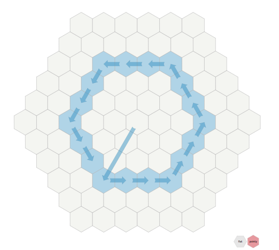

# Basic, fundamentals
- All we have is sets of objects and operations (functions/transformations/mappings).
- Sets are objects too.
- Opearions can be used as objects themselves - as inputs to other operations.
- Not everything is an operation: objects that are wrapped (take 0 arguments and return
  themselves) are not the same as unwrapped object.
- Examples of sets of objects and operations on them:
    - Numbers are object that encode some quantity.
      Couning, addition, multiplication, substraction etc - operations on numbers.
    - Geometric objects are sets of points.
      Rotations, angle and distance measurements are all operations on those sets
      of points.

# Geometry
- We create a Euclidean space and then operate on sets of points in that space
- any figure is just a set of points in our space
- In a Euclidean space, smallest regions of space are squares/cubes

# Spaces
- One way to think of the Euclidean plane is as a set of points satisfying certain relationships, 
  expressible in terms of distance and angles. 
- We have our real space where any particle can move from one point to another.
  We, as a bunch of particles, move in that space. And that is all we do basically.
- In our real space we live in we know (see):
    - How points are located, in relation to each other (order).
    - We can step to (and only to) neighbouring points.
    - How much a movement between points cost (distance).
      Movement in any direction cost the same.
- We can then label points of our real space somehow, using some labelling method. 
- One method is label points in real space is called "equcledian space":
    - In a Euclidean space, smallest regions of space are squares/cubes
    - It actually does not label all real points, because diagonal steps cost more
      so it is only an approximation. We can not go to the smallest region of space
      using this method. we can only zoom out a bit and label like every 10th or 100th
      point of a real space that will make our labelling look good.
    - In this approximation, moving to a diagonal neighbouring point cost sqrt(2), instead of 1.
      Moving to other neighbours cost 1, as expected.
    - So, we zoom out a bit, label each 100th point of real space with a Euclidean space points
      say that this is a smallest region of space and we will use it as such.
    - This is just a visual labelling. And using a visual labelling we undesrtand that diagonal
      movement cost sqrt(2) steps on real space.
    - As a distance between our imaginate Euclidian space, we use distance between those points in
      a real physical space. Like: "ok, if we take that amount of space as 1 and label space
      using 2 perpendicular axis to that orthogonal projection gives us the vector, then the
      distance between any 2 points will be the amounty of those unit regions".
    - In linear algebra we pretend the Euclidean space is the reality (it is very convenient)
      and use it for everything.
    - So, in short: label each 100th point of real space the way that there are 2 axis with
      equal steps and orthogonal to each other and then pretent that it is a real space, but
      only use labelled dots now. Amount of real space steps between those dots will be how
      we define distance between our Euclidean dots.
- That is it, I just labelled all points of real space with my Euclidian points in a
  meaningful and convenient way. Now I can see that a distance between my points is actually
  a distance in a real space.

 
 
 

- Да, так получается что минимально возможный шаг по диагонали больше минимально возможного
  шага вбок/вверх, что бред, так как выбрать нклон осей мы можем любой и диагоняль можем
  направить в любом направлении. Но мы миримся с этим ради удобства.
- Ещё прикол в том, а как задать что такое "сосед" в плане чисел?
- Hexagonal Coordinate System - all neighbours are the same distance from each other
  but fuck knows how to properly label them with vectors so it make sence. Maybe label them with
  3-tuples but those 3-tuples are restricted (because we are in 2d).
- So BASICALLY, we need to label each point in a real physical space the way that:
    1. Distance (cost of moving) between neigbours is the same in any direction.
    2. It is convenient to label with vectors (tuples of numbers).
    3. In a rectangular grid system, diagonal step is always side\_step*sqrt(2)
    4. Hex system have a property of all neighbours are the same distance (cost of moving)
    but it's not obvious how to label it with vectors, and it's only in 2d.

# Basic stuff
- Usually we have a set of objects and operations defined on this set.
- every object has properties (operations on it) and it's meaning in a real world
- Every function/operation has it's algorithm, properties (distributive etc) and 
  it's meaning in real world.
- Functions/operations are also objects.
  We might have a function that does composition of functions, tnus, operates on
  functions as objects.
- Example: vector space - set of vectors with operarions like addition and scalar
  multiplication over some field (can bee seen as just a bunch of multiplication 
  operations).

Ок, это просто множество и на нём задана дистанция
Но почему тогда дистанция по диагонали задана именно так?
- Because that how real space we live in works. In a space we live in.

Пойми что ты расставляя свои точечки, сразу пользуешься евклидовым пространством, ты 
изначально точечи таким образом расставляешь что они на одном расстоянии друг от друга
(уже используешь расстояние) и что они под прямым углом друг к другу (используешь углы).
И потом когда ты смотришь длину (дистанцию) ты тоже смотришь дистанцию в этом уже сущаствующем
Евклидовом пространстве.

Нарисовав точки так вот перпендикулярно я сам расставил их в пространстве, сам ЗАДАЛ РАССТОЯНИЯ,
сам задал угла и ещё и сам сказал что дистанция/длина это вот количество пространства которое
я использовал а не создал. Если говорить о том которое я пытаюсь типа создать то там если я скажу
что шаг по диагонали равен шагу в бок то тогда сторона квадрата равна его диагонали (гипотенуза
равна

Мы живём просто типа в евклидовом пространсве где вот так вот получилось что длина гипотенузы
равна корню из суммы квадратов длин катетов. И это определяет дистанцию тоже получается. И
что такое гипотенуза это типа нужен прямой угол итд. Тоесть мы можем делать ротации и знать что
такое прямой угол.

Ты не можешь просто взять и расставить точки в пространстве и сказать ок длина этого пространства
отражает расстояние, это тупо ты повторяешь пространство.
ЧТобы именно СОЗДАТЬ пространство у тебя вот есть набор векторов (или 2 множества скаляров)
и пожалуйста, сделай с ним что-то.

Ты сам как бы используешь больше пространства (реального) на переход по диагонали и потом
ещё и сам это пространство измеряешь чтобы получить длину... Это же тупо.

Ты САМ длину задаешь как количество реального пространства, подсознательно. И да, длина
обычно и есть количество реального пространства.

Что вообще такое пространсво? Это что-то где можно перемещаться просто, что-то где есть
длины и расстояния.

So:
- Our space where I know (see):
    - How points are located, in relation to each other (order).
    - How much a movement between points cost (distance).
    - Can move only to neighbouring points.
- I can then label points of out real space with a pints from a equcledian space the way that:
    - Preserves order of points and relative positions
    - preserves the fact that making a (0, 0) -> (1, 1) or similar step cost sqrt(2) of our
    real space (distance) and making a (0, 0) -> (0, 1) step or similar, cost 1.
- That is it, I just labelled all points of real space with my Euclidian points in a
  meaningful and convenient way. Now I can see that a distance between my points is actually
  a distance in a real space.
- Да, так получается что минимально возможный шаг по диагонали больше минимально возможного
шага вбок/вверх, что бред, так как выбрать нклон осей мы можем любой и диагоняль можем
направить в любом направлении. Но мы миримся с этим ради удобства.
- Ещё прикол в том, а как задать что такое "сосед" в плане чисел?
- Hexagonal Coordinate System - all neighbours are the same distance from each other
but fuck knows how to properly label them with vectors so it make sence. Maybe label them with
3-tuples but those 3-tuples are restricted (because we are in 2d).
- So BASICALLY, we need to label each point in a real physical space the way that:
    1. Distance (cost of moving) between neigbours is the same in any direction.
    2. It is convenient to label with vectors (tuples of numbers).
    3. In a rectangular grid system, diagonal step is always side\_step*sqrt(2)
    4. Hex system have a property of all neighbours are the same distance (cost of moving)
    but it's not obvious how to label it with vectors, and it's only in 2d.
- I could have gone with some different coordinates, like then (1, 1) is the same (real) distance
from (0, 0) as from (1, 0). And then it might me a bit less convenient.
- Кароче наше пространство это набор точек (векторов) и мы чувствует расстояние между разными
точками. Наше пространство не знает про углы итд, только про расстояния и про порядок точек.
Мы берём точки этого пространства помечаем своими точками и так как мы чувствуем расстояния
то можем пометить точки так что типа будет окружность, будет прямой угол (длина окружности
на радиус) и так далее. И вот таким образом мы можем задать в нашем реальном пространстве
наше Евклидово пространство, тупо присвоив реальным точкам наши точки определённым образом,
опираясь на наше чувство расстояния между точками реального пространства. И теперь мы удобно
для себя пометили реальное пространство и при такой удобной разметке получается что вот
теорема Пифагора и такое вот отношение дуги к радиусу итд.
- Любое расположение точек на плоскости или на другой фигуре, это уже использование нашего
пространства.
- Распологая точки по 1д прямой или по кругу, ты уже задаешь порядок поределённый на этом 
множестве. Используя количество нашего пространства как меру расстояния ты задаешь
определение расстояния на этом множестве. 
Добавляя второе множество перпендикулярно ты задаешь определение углов, порядка между
векторами 2д, расстояние в 2д и так далее.
- Есть наше реальное пространство. Мы его точкам присвоили свои точки вот таким образом
и наше пространство нам сказало что вот перемещение между этими вот точками стоит дороже,
и вот так оно считается и тут мы можем и угла определить с помощью этого. 
- ТОСЕТЬ, если пометить точки реального пространства таким образом что самые близкие точки
будет отличаться на 1 минимальный шаг одной координаты и чуть дальше будут точки
отличющиеся на 1 шах 2х координат и потом на 1 шаг 3х кординат и ещё что то там про углы
и ротации, мы получим евклидово пространство состоящее из точек нашего реального
пространства. Мы же знаем (чувствуем, можем измерить) расстояние мду точками реального
пространства и углы тоже. Так мы присваиваем этим точкам свои точки (векторы), чтобы
вот удобно было. И вот по-этому двигаться по диагонали дороже, так как мы сами точки так
присвоили.
- Мы (грубо говоря) живем в евклидовом пространстве, во множестве векторов на котором
заданы углы и дистанция.
- Потом я сам беру и пытаюсь на этом множестве расставить ствои векторы, присвоить
векторам этого множества свои, другие и задать какую-то меру дистанции и углов тоже свою.
- И наше пространство оно вот такое, типа Евклидово, имеет такие вот формулы для углов
и расстояний (пространство - набор векторов).
- И любое расположение точек препендикулярно и равноудалённо на плоскости это уже заимствование
нашего пространства, использование углов и расстояний из нашего реального пространства.
- Да даже если не перпендикулярно и не равноудалённо, как ты не распологай, если ты
используешь как расстояние число нашего пространства, то ты ну получаешься задаешь
это метрику в терминах нашего пространства.
- Почему такое отношение расстойний (0, 0) -> (1, 1) и (0, 0) -> (1, 0)?
Потому что если мы перпендикулярно поставим 2 прямых множества с равноудалёнными 
точками координату зададим как ортогональную проекцию и как расстояние будем использовать
количество нашего реального пространтва, то вот так получается, вот и всё.
- Наше реальное пространство, если таким вот образом ему присвоить точки (квантизовать)
равноудалённо, прямой угол, вот это вот всё, то двигаться по диагонали вот на столько дальше или
дольше или дороже, называй как хочешь. 
- Пространство это тупо надор точек и в них типа атомы распологаются.
- И мы говорим типа ок, давайте херанём нашему реальному пространству...
- Не представляй "рисунки на точках" это так не работает. Представляя эти точки ты
сам вписываешь их в наше реальное пространство и это уже не новое пространство. Ты
сам представляешь расстояние между этими точками как расстояние в нашем реальном пространстве уже.
Не важно как ты расположишь точки относительно друг друга, ты их распологаешь и представляешь
в нашем пространстве. 
- Представить другое пространство можно тупо множеством векторов (не вписывая его в наше
пространство). В этом пространсве круг может иметь другую формулу, гипотенуза тоже,
(1, 1) может быть равноудалена от (0, 0) и от (0, 1). И так далее. 
- In our real space, if we take a rectangle (right angles), the amount of that space
between it's angles are set by a pythagores theorem.
- We can use some other angles to assign vectors to dots (dots are on our real flat space),
then distance (amount of our real space) from (0, 0) to (1, 1) might be the same or evel 
less then distance
- by changing angles, we implicitly change the definition of distance between dots. Because
our space is just a different space laying on top of real space and we just use the amount
of real space to create our own distance metric on our weird space.
- If you want to create a space, be aware that use should not use our real scpace or if you
use it, it will
- Be aware that use implicitly use right angles to assing numbers (vectors) to dots on
our real space.
- For now, just relax and work with q quantised euclidian space.
- If you start learning somehing, understand that you will never really "finish" learning
it, you will just gradually get better and better, covering more and more topics and
remembering those topics better and better.

Глубже пока идти не нужно.

